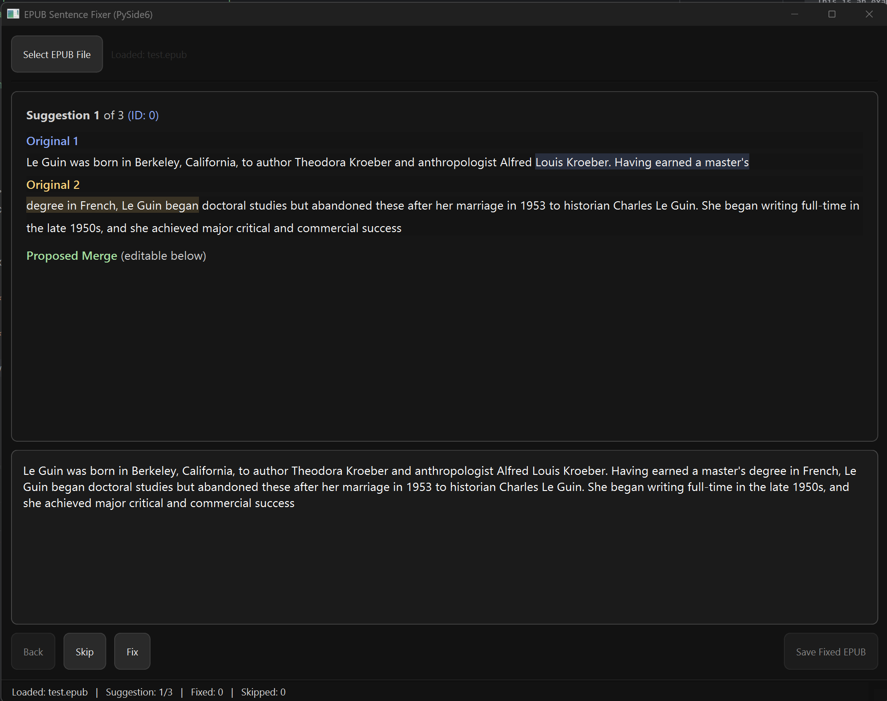

# EPUB Sentence Fixer

EPUB Sentence Fixer helps you review and repair broken sentences caused by poor PDF-to-EPUB conversions.

The app scans an EPUB, detects likely sentence splits where text was incorrectly pushed into a new paragraph, and presents each case for manual review. You can inspect both original paragraphs, edit the proposed merge, accept or skip each suggestion, and save a corrected copy of the EPUB.

The original source EPUB remains untouched. Accepted changes are written into a new output EPUB and logged in a separate text file.

<p style="text-align: center;">
  
</p>


## What The App Shows

For each detected case, the app displays:

- `Original paragraph 1`
- `Original paragraph 2`
- `Split detected`
- `Proposed corrected paragraph`

The detected split is highlighted in the original paragraph panels and in the proposed corrected paragraph, so the merge point is easy to review.

## Workflow

1. Open an EPUB file.
2. Review each detected suggestion from the left sidebar.
3. Edit the proposed corrected paragraph if needed.
4. Click `Accept Fix` or `Skip`.
5. Save the corrected EPUB when review is complete.

## Features

- Light desktop UI with a review-oriented layout
- Sidebar with all detected suggestions
- Status tracking for pending, fixed, and skipped suggestions
- Highlighted split markers in original and merged text
- Global content font-size control for review panels
- Keyboard shortcuts for faster desktop workflow
- Unsaved-change protection on close
- Output log for accepted fixes

## Example

Broken:

```text
This is an example of a broken sentence that was split
into two separate paragraphs during conversion.
```

Fixed:

```text
This is an example of a broken sentence that was split into two separate paragraphs during conversion.
```

## Requirements

Install the dependencies listed in [requirements](C:/Users/damir/PycharmProjects/EPUB_FIX_Sentence/requirements):

```text
ebooklib
beautifulsoup4
pyside6
```

## Run

```powershell
python main.py
```

If you use the local virtual environment:

```powershell
.venv\Scripts\python.exe main.py
```

## Build

Build a Windows executable with PyInstaller:

```powershell
.venv\Scripts\pyinstaller.exe --noconfirm --clean --windowed --name "EPUB Sentence Fixer" main.py
```

If you add a Windows `.ico` file later, use:

```powershell
.venv\Scripts\pyinstaller.exe --noconfirm --clean --windowed --name "EPUB Sentence Fixer" --icon assets\epub-sentence-fixer-icon.ico main.py
```

## Assets

Project icon:

- [epub-sentence-fixer-icon.svg](C:/Users/damir/PycharmProjects/EPUB_FIX_Sentence/assets/epub-sentence-fixer-icon.svg)


